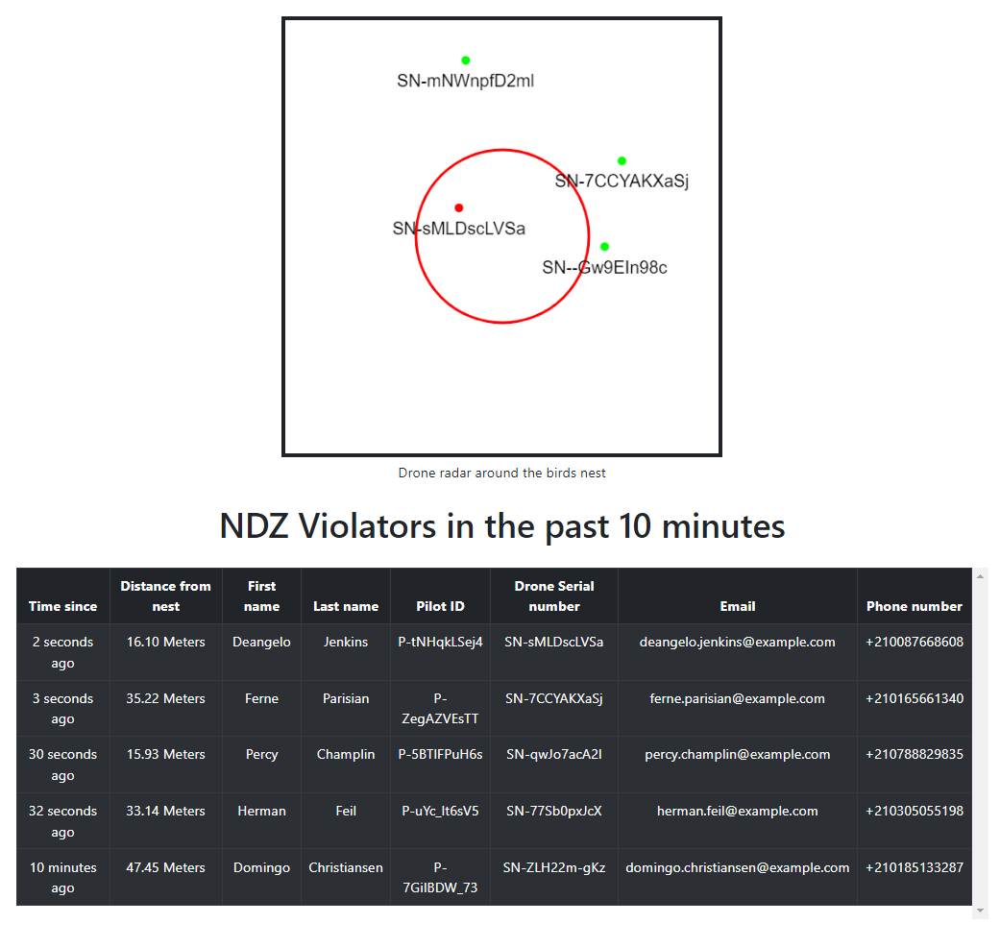

Project Birdnest assignment https://assignments.reaktor.com/birdnest/

## Assignment
A rare and endangered Monadikuikka has been spotted nesting at a local lake.

Unfortunately some enthusiasts have been a little too curious about this elusive bird species, flying their drones very close to the nest for rare photos and bothering the birds in the process.

To preserve the nesting peace, authorities have declared the area within 100 meters of the nest a no drone zone (NDZ), but suspect some pilots may still be violating this rule.

The authorities have set up drone monitoring equipment to capture the identifying information broadcasted by the drones in the area, and have given you access to a national drone pilot registry. They now need your help in tracking violations and getting in touch with the offenders.

`GET assignments.reaktor.com/birdnest/drones`

The monitoring equipment endpoint above provides a snapshot of all the drones within a 500 by 500 meter square and is updated about once every 2 seconds. The equipment is set up right next to the nest.

This snapshot is in XML format and contains, among other things, the position and serial number of each drone in the area.

- The position of the drones are reported as X and Y coordinates, both floating point numbers between 0-500000
- The no-fly zone is a circle with a 100 meter radius, origin at position 250000,250000

`GET assignments.reaktor.com/birdnest/pilots/:serialNumber`

The national drone registry endpoint above will provide you the name, contact information and other details for a drone's registered owner in JSON format, based on the given serial number. Please note on a rare occasion pilot information may not be found, indicated by a 404 status code.

In order to protect the privacy of well behaved pilots keeping appropriate distance, you may only query this information for the drones violating the NDZ.

## Objective

Build and deploy a web application which lists all the pilots who recently violated the NDZ perimeter.

- Persist the pilot information for 10 minutes since their drone was last seen by the equipment
- Display the closest confirmed distance to the nest
- Contain the pilot name, email address and phone number
- Immediately show the information from the last 10 minutes to anyone opening the application
- Not require the user to manually refresh the view to see up-to-date information

## Introduction

The app displays the drones currently in the area and the NDZ perimeter.
  

If a drone crosses into the NDZ perimeter The app will add the information of the pilot and the drone to the NDZ violators list.

The app will display realtime data received from the backend

## Built with

- React.js
- Node.js
- Express.js
- Socket.io
- Mongoose

## Dependencies
- dotenv
- bootstrap
- axios
- fast-xml-parser